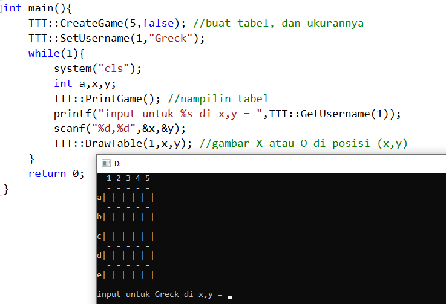
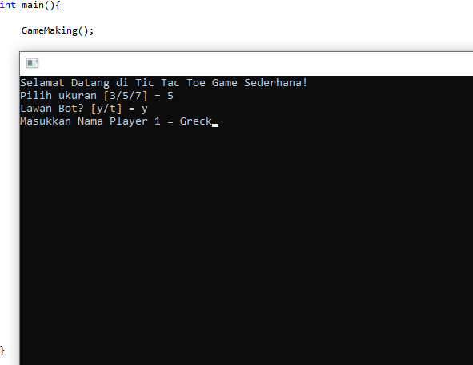
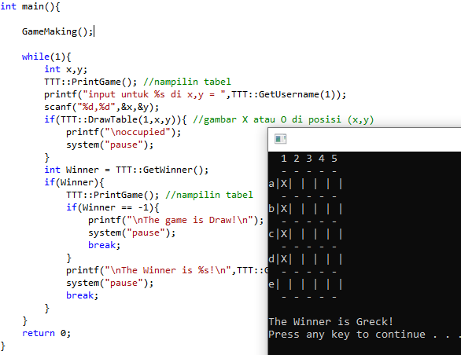
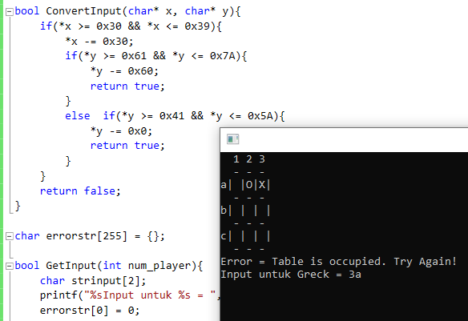
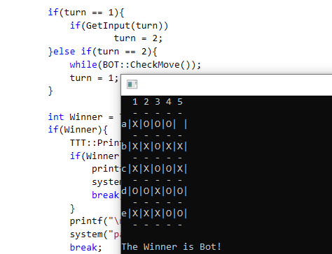
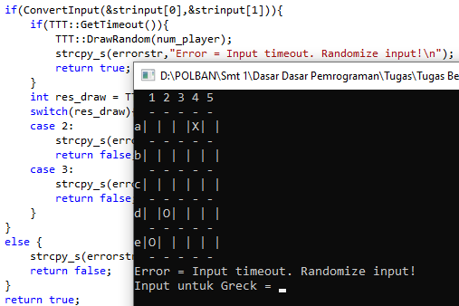
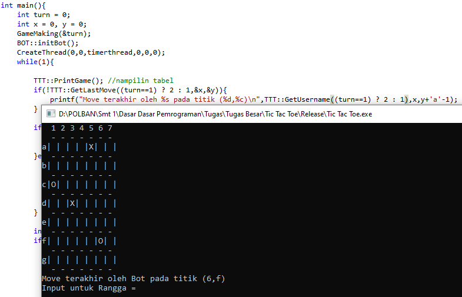
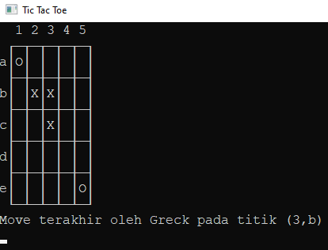
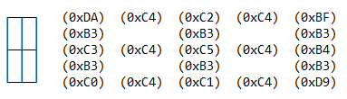

# Tic-Tac-Toe-Game

#### A simple Tic Tac Toe Game program made in c++

**TODO LIST**
1. ~~Draw table~~ (20 December 2020)
2. ~~Print table~~ (20 December 2020)
3. ~~Username in game~~ (20 December 2020)
4. ~~Create Game Making~~ (21 December 2020)
5. ~~Get a Winner~~ (21 December 2020)
6. ~~Create "Turn" function~~ (22 December 2020)
7. ~~Create Bot Movement~~ (23 December 2020)
8. ~~Make some difficulties~~ (28 December 2020)
9. ~~Add input timeout~~ (27 December 2020)
10. ~~Get last move information~~ (28 December 2020)
11. ~~FINAL: Wrap the code!~~ (31 December 2020)
12. Create Documentation about this game.

**(WORK IN PROGRESS)**

20 December 2020 
 
I Created many function as initial commit. 

21 December 2020 
 
I Created Game Making function to initializing a game 

 
I Created function to determine the winner 

22 December 2020 
 
I Created a function to handle the input and its error. And as you can see, the movement is turnable now. 

23 December 2020 
 
I Created and tested bot movement. It reads possibilities until next 3 steps. 

26 December 2020 
I fixed bot movement and some functions 
psst.. I think bot thinking should has timeout interval. 

27 December 2020 
 
I Created and tested timeout interval. And of course bot movement has timeout interval too. 

28 December 2020 
 
I Created and tested bot difficulties from level 1 to 5. Also tested last move information. 
But, the code is so messy. I have to clean the code and wrap it up. 

31 December 2020 
 
I Redesigned the table. Now the table has continuous line. 
I used many ascii code, Here is the list. 
 

 
I Created function that celebrating the winner. 